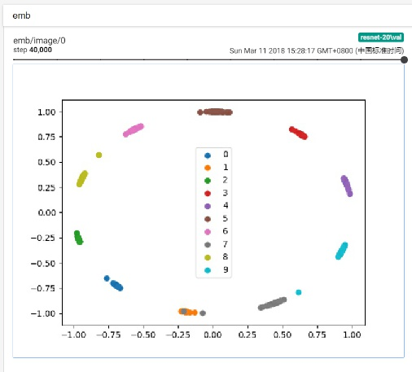

# Description
This project implements triplet loss and semi-hard mining with tensorflow. It also shows how to train model on mnist, cifar10 or cifar100 with triplet loss.

The semi-hard mining is *purely* implemented with tensorflow, thus can seamless integrate into tensorflow graph and take advantage of gpu acceleration. It will speed up the training process.

# Requirement
- python==3.6
- tensorflow==1.6.0
- matplotlib, for visualization.

# Run
```bash
# train
python train.py

# tensorboard visualization
tensorboard --logdir log
```

# Tensorboard Visualization
Tensorboard visualization of the mnist data's features.


# Note
## 1. Number of Features
The number of features uses by default is 2, which makes visualization easy and converges well for mnist dataset. When training with cifar10, the number of features should be more for a better convergece. 

## 2. Semi-Hard Mining
Because the semi-hard mining is implemented in tensorflow, this project uses an end-to-end training process. The 'end-to-end' here means doing semi-hard mining and training at once. It can minimize the overhead involved by the hard mining process. 

This approach is possible only if the memory is not the issue. However, training with triplet loss usually require a large batch size for online hard mining, which may need a lot of memory. So it is not always possible using the 'end-to-end' approach for a large model.

One way to work around this memory issue is separating hard mining and training process. It first does serveral times of semi-hard mining to find the hard triplets, and then feed the selected triplets to model for training. The approach involve much more overhead than the one above, but it is suitable for memory limited situation. For how this work, see the code in [facenet](https://github.com/davidsandberg/facenet) and try to replace the semi-hard mining code with the one implemented here.


# Reference Project
- [facenet](https://github.com/davidsandberg/facenet), Face recognition using Tensorflow.
- [openface](https://github.com/cmusatyalab/openface), Face recognition with deep neural networks. 
